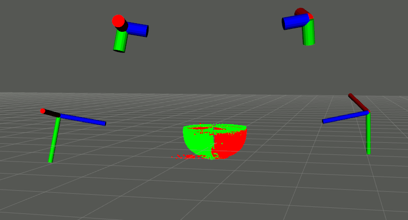

# Distributed-Robot-Perception-Project
<!--    -->
### Installation
Clone into your workspace
```
cd <path/to/your/ros2/ws>/src
git clone https://github.com/Hydran00/Distributed-Robot-Perception-Project.git project
git clone https://github.com/Hydran00/pc2-coppeliasim-ROS2
cd .. && colcon build --symlink-install
```
Then follow the instruction described [here](https://github.com/Hydran00/pc2-coppeliasim-ROS2/blob/master/README.md)

### Launch sim
```
cd ~/CoppeliaSim
./coppeliaSim.sh
```
Then open a scene between:
  - `coppeliasim_cube.ttt`
  - `coppeliasim_bowl.ttt`
  - `coppelisim_dragon.ttt`
 using `File -> Open Scene` in CoppeliaSim.

### Launch ROS sim
- Full simulation:
    ```
    ros2 launch project full_simulation.launch.py
    ```
- Voronoi calculator and scanning algorithm
    ```
    ros2 run project voronoi_calculator
    ```

